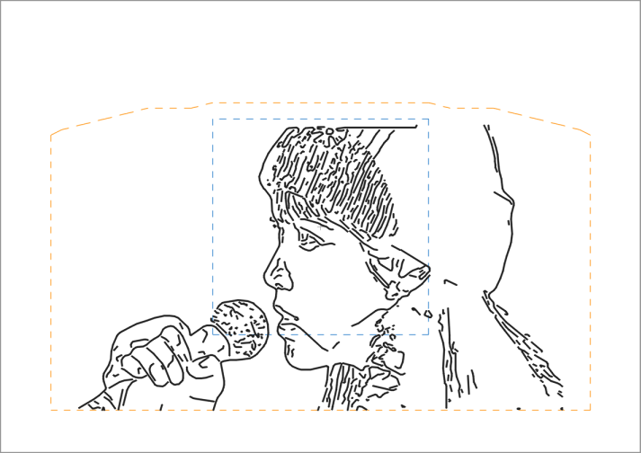
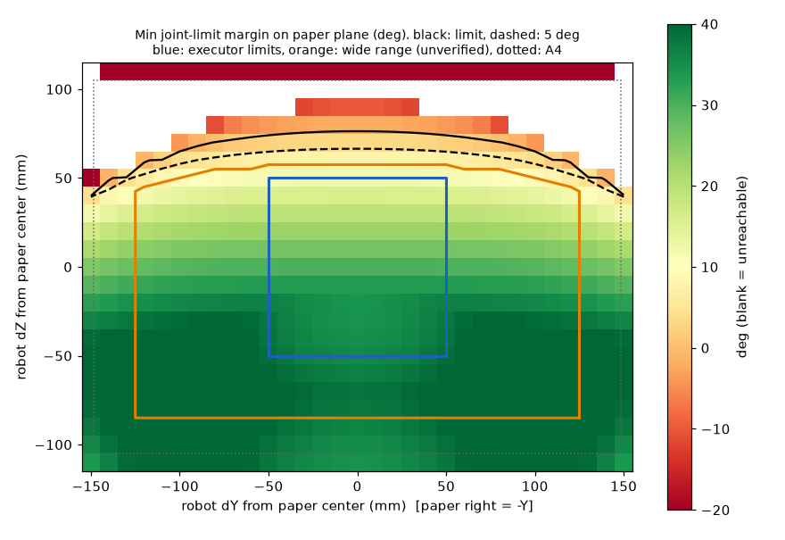

# 2026-09-26 — 더 크게 그리기 (도달 범위에 맞춘 넓은 범위)

## 문제
- **증상:** 그림이 작습니다.
  - 실행기가 허용하는 범위는 실물로 확인된 ±50mm(100×100)이고, 실물 확인 전 "넓은 범위"도 ±60mm(120×120)뿐이었습니다.
  - 긴 변 100mm에서는 선이 촘촘해 0.5mm 펜으로 뭉개지고, 전신 사진의 얼굴은 9~21mm밖에 안 됩니다.
- **원인:** 대칭 사각형은 팔이 실제로 닿는 모양과 맞지 않습니다. 도달 지도(시뮬레이터, 자세 고정)를 보면 다음과 같습니다.
  - 좌우 ±150, 아래 −110mm까지는 여유가 큽니다.
  - 위쪽만 B(J5) 30° 한계에 걸리고, 그 높이는 가운데 +60mm에서 좌우 끝 +42.5mm로 낮아집니다.
  - ±60 사각형은 위쪽 한계에 맞춰 좌우·아래까지 좁게 잡은 셈입니다.

## 해결
- **넓은 범위를 지붕 모양 영역으로 (`limits_pending_verification`):**
  - 좌우 ±125mm, 아래 −85mm, 위는 가로 위치별 한계입니다(가운데 +57.5 → 끝 +42.5, 점 사이 직선).
  - 한계는 도달 지도(2.5mm 격자)에서 관절 여유가 7° 이상인 높이에서 2.5mm를 뺀 값이고, 종이 안전 여백 20mm 안으로 잘랐습니다.
  - **여전히 실물 미확인입니다.** 로봇으로 그릴 때 "넓은 범위(실물 미확인) 허용"을 체크해야 쓸 수 있고, 실물 확인 범위 ±50mm는 그대로입니다.
- **`limits.Region`:**
  - 영역 판정, 테두리, 배치 맞추기(`fit`), 최대 배율을 제공합니다.
  - 예전 대칭 형식도 읽습니다.
  - 설치판 사용자 폴더에 예전 기본값(±60, 손대지 않음)이 남아 있으면 새 영역으로 바꿉니다.
- **종이 배치:**
  - 큰 그림은 종이 중심에 들어가지 않으면 가장 적게 아래로 옮기고, 그래도 안 되면 들어갈 만큼 줄입니다.
  - 100mm 이하는 지금처럼 가운데에 둡니다(결과 동일).
  - mm↔px 변환에 이 이동(`transform.ox/oy`)을 반영했습니다.
- **그리기 크기 상한:** 120 → 250mm(영역 폭)
- **자동 구도:** 종이 위 얼굴 크기를 요청한 크기가 아니라 영역에 맞춘 실제 크기로 추정합니다.
- **화면:**
  - 종이 미리보기에 실물 확인 범위(파란 사각형)와 넓은 범위(주황 지붕)를 그립니다.
  - "±60mm" 문구를 "넓은 범위(실물 미확인)"로 바꿨습니다.
  - 도달 지도에도 두 영역을 그립니다.
- **시험 경로:** `trajectories/border-test-60mm.json`을 `border-test-wide.json`(새 영역 테두리, 250×142.5mm)으로 바꿨습니다.

## 확인
- **자동 테스트:** `tests/test_limits.py`
  - 영역 판정, 예전 형식, 배치(가운데 유지·아래로 이동·축소), 설정 이전, 실행기 검사, 세션 mm↔px 왕복
  - **시뮬레이터 안전 테스트:** 영역 테두리와 내부 가로줄을 실행기와 같은 계획으로 시뮬레이션해, IK 실패·관절 한계 초과가 없고 최소 여유가 5° 이상인지 확인합니다.
  - 전체 테스트 통과, pyflakes 깨끗
- **새 테두리 경로 시뮬레이션:** PASS. 가장 빠듯한 B(J5)가 한계까지 8.4° 남습니다.
- **실제 그림 (긴 변 250mm 요청, 넓은 범위):**

| 그림 | 실제 크기 | 배치 | 예상 시간 | 시뮬레이션 |
|---|---|---|---|---|
| illust1 (100mm, 이전 기본) | 95×100mm | 가운데 | 23.5분 | PASS (B 12.0°) |
| illust1 | 132×140mm | 15mm 아래 | 27.7분 | PASS (B 9.9°) |
| photo1 (가로) | 224×132mm | 19mm 아래 | 28.0분 | PASS (B 12.0°) |
| photo2 (세로) | 80×142.5mm | 14mm 아래 | 25.8분 | PASS (B 9.0°) |

## 다음 (로봇이 있을 때)
1. F 시험으로 좌우 부호를 확인합니다.
2. `mirobot-draw trajectories/border-test-wide.json --execute --air --pending-limits`로 펜 없이 테두리를 따라갑니다.
3. 펜을 대고 같은 경로를 그려, 위쪽 지붕 구간에서 Soft limit이 없는지 봅니다.
4. 이상이 없으면 `limits`(실물 확인 범위)를 넓히고 `status`를 갱신합니다.
