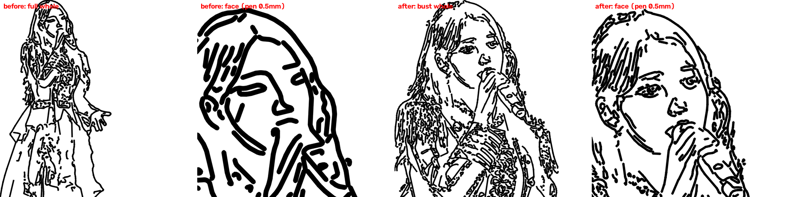
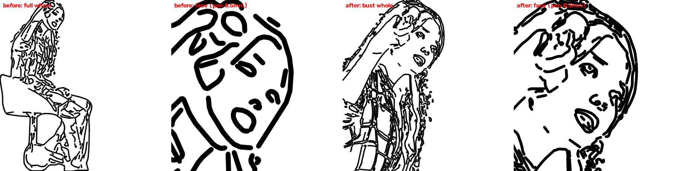
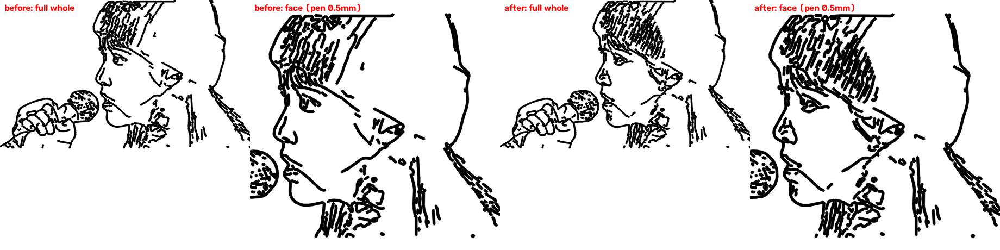

# 2026-09-26 — 얼굴 섬세하게 그리기 (자동 구도 + 얼굴 세밀 처리)

## 문제
- **증상:** 사진 속 얼굴이 뭉개졌습니다(사용자 요청: "얼굴은 더 섬세하게").
- **원인 1 — 해상도:** 파이프라인은 긴 변 800px로 줄여 선을 찾습니다. 전신 사진은 얼굴이 60~110px밖에 안 됩니다.
- **원인 2 — 종이 크기와 펜 굵기:** 긴 변 100mm로 그리면 전신 사진의 얼굴은 9~21mm입니다.
  - 실험으로 얼굴만 원본 해상도로 다시 처리해 보니, 확대해서 보면 눈·코·입이 살아났습니다.
  - 하지만 종이 크기로 보면 0.5mm 펜 선이 겹쳐 검은 덩어리가 됐습니다.
  - 즉 선만 늘리는 것으로는 해결되지 않습니다.
- **검출기:** OpenCV 5에는 예전 Haar 검출기가 빠져 있어 YuNet(`FaceDetectorYN`)을 씁니다.
  - 사진 3장은 모두 검출됐습니다(신뢰도 0.78~0.93, 옆얼굴 포함).
  - 애니 그림 3장은 검출되지 않았습니다.

## 해결 (사용자 선택: 실사 사진 대상, A+B, 구도 자동)
- **얼굴 검출 (`faces.py`):**
  - YuNet 모델(232KB, MIT)을 패키지에 넣었습니다. 라이선스는 `THIRD_PARTY_NOTICES.md`에 적었습니다.
  - 긴 변 800px에서 검출하고, 신뢰도 0.7 미만과 아주 작은 얼굴(짧은 변의 3% 미만, 무대 조명 오검출)은 버립니다.
  - 모델이 없거나 오류가 나면 "얼굴 없음"으로 동작합니다.
- **B — 자동 구도 (① 원본 "구도"):**
  - 얼굴이 하나이고, 전체로 그렸을 때 종이 위 얼굴이 25mm보다 작으면 **원본 해상도에서** 상반신(세로 4:5)으로 자른 뒤 800px로 맞춥니다.
  - 전체·상반신·얼굴을 직접 고를 수도 있습니다.
  - 실제 자르기 틀이 바뀔 때만 편집 기록을 비우고 알립니다. 종이 크기만 바꿔 틀이 그대로면 편집이 유지됩니다.
- **A — 얼굴 세밀 (새 단계 ⑦, 단계 10개):**
  - 얼굴 타원(상자의 1.3×1.4배) 영역을 원본에서 잘라 긴 변 500px로 키운 뒤, 전처리부터 이어 붙이기까지 다시 돌립니다. Canny 기준에는 민감도 0.6을 곱합니다.
  - 전체 그림의 타원 안 선을 이 결과로 바꿉니다. 경계를 지나는 선은 경계에서 잘라 바깥 부분을 남깁니다.
  - 교체된 원래 선은 살리기 후보가 됩니다.
  - **밀도 제한:** 펜 굵기(기본 0.5mm)를 종이 크기로 px 환산합니다. 그보다 촘촘한 선은 합치고, 펜 굵기 3배보다 짧은 선은 버립니다. 단, 눈·코·입 5개 점 근처는 남깁니다.
- **캐시:**
  - 얼굴 단계는 종이 크기에도 의존합니다.
  - 얼굴이 없거나 세밀 처리를 끄면, 캐시 키에서 종이 크기를 뺍니다. 얼굴이 없는 그림에서 종이 크기만 바꿔도 번호·제안이 유지되게 하기 위해서입니다.
  - 기존 테스트 `test_box_change_keeps_numbers_and_proposals`가 이 회귀를 잡았습니다.

## 확인
- **자동 테스트:** 31개를 추가했습니다(검출 8, 구도 8, 세션 8, 얼굴 단계 7). 전체 216개 통과, pyflakes 깨끗, 골든 기준값 그대로입니다(얼굴 없는 이미지는 결과 동일).
- **패키지:** wheel에 모델 파일이 들어가는 것을 확인했습니다(exe는 같은 패키지 데이터를 `collect_data_files`로 가져감).
- **실제 사진** (이미지 종류 프리셋 적용, 긴 변 100mm):

| 사진 | 이전 (전체, 세밀 끔) | 이후 (기본) | 구도 |
|---|---|---|---|
| photo1 (옆얼굴 클로즈업) | 획 270 · 명령 2250 · 15.3분 | 획 345 · 명령 2722 · 18.6분 | 전체 |
| photo2 (무대 전신) | 획 333 · 명령 2930 · 19.6분 | 획 738 · 명령 6093 · 40.8분 | 상반신 (전체로는 14mm) |
| photo3 (의자 전신) | 획 207 · 명령 1812 · 13.5분 | 획 370 · 명령 3328 · 23.2분 | 상반신 (전체로는 9mm) |
| illust1 (애니) | 획 296 · 명령 3347 | 같음 | 전체 (얼굴 없음) |

- 각 그림의 왼쪽 두 칸은 이전, 오른쪽 두 칸은 이후입니다. 칸마다 전체 그림과 얼굴 부분(펜 0.5mm 실제 굵기)입니다.

## 다음
- **그리는 시간:** 상반신으로 자르면 몸·옷 선도 커지면서 명령과 시간이 약 2배가 됩니다(photo2 19.6분 → 40.8분). 필요하면 상세도를 낮추거나 구도를 "얼굴"로 고르면 됩니다.
- **자동 구도 기준:** 종이 위 얼굴 크기는 이미지 긴 변 기준 추정입니다. 배경 제거를 켜면 그림이 이미지보다 작아서, 실제 얼굴은 추정보다 조금 큽니다.
- **실물 확인:** 실제 펜 드로잉에서 눈·입이 알아볼 만한지 확인해야 합니다.
