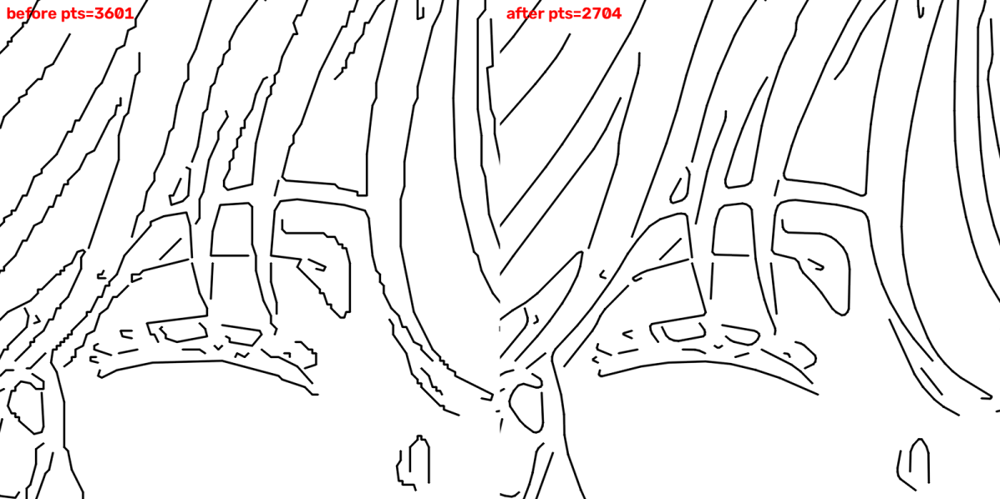
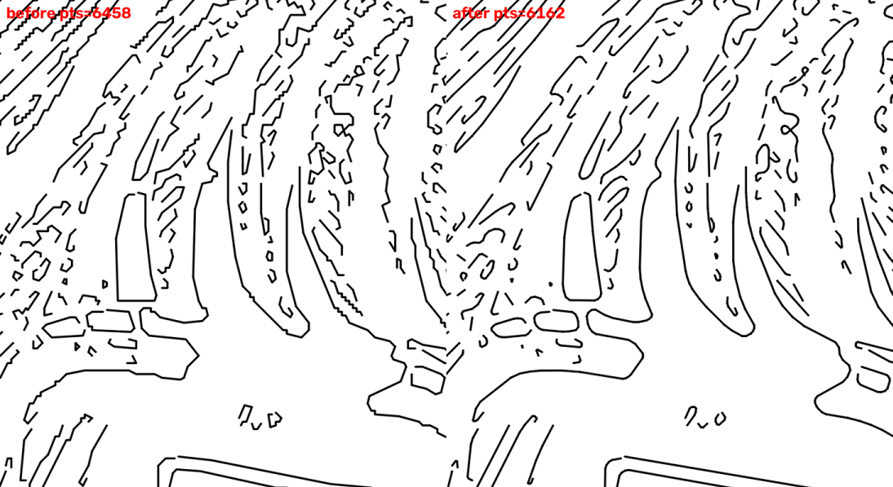

# 2026-09-26 — 선 스무딩 (계단·톱니 제거)

## 문제
- **증상:** 결과 선이 매끄럽지 않고 뾰족한 느낌이었습니다(사용자 관찰). 특히 사선과 완만한 곡선에서 계단·톱니 모양이 보였습니다.
- **원인:**
  - 뼈대를 따라간 획은 1px 격자 위의 계단 모양이고, Canny 경계는 1px씩 흔들립니다.
  - 단순화(approxPolyDP)가 계단 모서리를 꼭짓점으로 남기고, 로봇은 꼭짓점 사이를 직선으로 그립니다. 그래서 곡선이 지그재그 다각형이 됩니다.
  - **재현:** ±1.2px 흔들린 반지름 150px 원호에서 점 31개, 꺾는 방향이 25번 바뀌고, 가장 큰 꺾임은 72°였습니다.

## 해결
- **"⑦ 단순화" 단계를 "⑦ 스무딩·단순화"로 바꿨습니다.** 단계 수와 번호는 그대로이고, 순서는 스무딩 → 단순화 → 모서리 둥글리기입니다.
  - **`smooth_strokes(strokes, sigma_px)`:** 획을 따라 가우시안으로 다듬습니다. 열린 획은 끝점을 고정하고, 끝을 점대칭으로 덧대서 끝부분이 안쪽으로 끌려가지 않게 합니다. 닫힌 획은 고리째 다듬습니다.
  - **`round_corners(strokes, iterations, max_dev_px=1)`:** Chaikin 방식으로 꼭짓점 하나를 점 두 개로 바꿔 둥글게 합니다. 깎는 양은 원래 꼭짓점에서 1px 이상 벗어나지 않게 꺾임 각도에 맞춰 줄입니다.
  - **조절 값:** 스무딩 세기(기본 2px, 0=끔), 모서리 둥글리기(기본 1회, 0~3). 단순화 오차는 그대로입니다.
  - **소수 좌표:** 스무딩한 획은 소수 좌표로 흐릅니다. 정수로 반올림하면 계단이 다시 생기기 때문입니다. 아래 단계(편집, 순서, 종이 변환, 그림)는 이미 소수를 받습니다. 두 값을 0으로 두면 결과가 이전과 똑같습니다(정수 그대로).
- **구현 중 찾은 문제:** 일반 Chaikin은 선분 1/4을 깎아서, 되돌아가는 뾰족한 끝을 크게 잘라 냈습니다.
  - 예: 굵은 선의 양쪽 경계가 납작한 고리가 된 경우, 260px 선이 양끝에서 65px씩 짧아졌습니다.
  - 머리카락 끝 같은 V자도 106px에서 90px로 짧아졌습니다.
  - 벗어나는 거리를 제한하는 방식으로 바꿔 해결했습니다(테스트 `test_rounding_keeps_sharp_tips`).
- **문서:** 에이전트 안내문과 README의 단계 이름을 바꿨습니다. 파이프라인 기준값(`tests/data/pipeline_golden.json`)은 의도한 변경이라 다시 저장했습니다.

## 확인
- **자동 테스트:** `tests/test_smoothing.py`에 8개를 추가했습니다(전체 184개 통과, pyflakes 깨끗).
  - 흔들린 원호: 방향이 바뀌는 횟수 ≤ 2, 최대 꺾임 < 25°
  - 끝점 고정, 닫힌 원은 닫힌 채 반지름을 유지
  - 0 설정이면 이전과 동일
  - 짧은 획, 뾰족한 끝 보존, 완만한 모서리 둥글리기
- **샘플 이미지** (기본 설정, 점 수 = 로봇 명령 수):

| 이미지 | 획 | 점 (전 → 후) |
|---|---|---|
| illust1_color | 293 | 3601 → 2704 |
| photo3_chair | 313 | 2387 → 2661 |
| illust3_manga | 877 | 6458 → 6162 |

## 다음
- 실제 펜 드로잉에서 매끄러움을 확인해야 합니다. 로봇이 짧은 직선 여러 개를 이어 그릴 때 꼭짓점마다 멈칫하는지도 함께 봅니다.
- 아주 작은 닫힌 모양(몇 px)은 점처럼 작아질 수 있습니다. 필요하면 스무딩 세기를 낮추면 됩니다.
