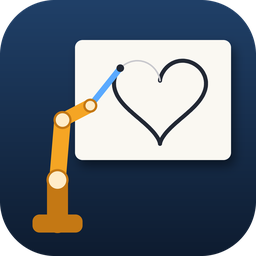

# Open Sourse Software - (2026-2)

- [O] Make a repositories
- [O] write README.md

---

## 텀프로젝트: Mirobot Photo Sketch



[](https://github.com/yoobinkim541/OSS-2026-Mirobot-Photo-Sketch/actions/workflows/ci.yml)
[](https://github.com/yoobinkim541/OSS-2026-Mirobot-Photo-Sketch/releases)
[](LICENSE)

사진을 입력하면 OpenCV로 선 경로를 만들고, WLKATA Mirobot 로봇팔이 벽에 붙인 A4 용지에 펜으로 그리는 오픈소스프로그래밍 텀프로젝트입니다.

```
사진 ─▶ CV/make_strokes.py (또는 gui_sketch.py) ─▶ 획 JSON (종이 mm)
     ─▶ robot/draw_executor.py (dry-run → --execute) ─▶ Mirobot 펜 드로잉
```

### 설치

**Windows 사용자 (파이썬 없이):** [Releases](https://github.com/yoobinkim541/OSS-2026-Mirobot-Photo-Sketch/releases)에서 받습니다.
- `MirobotSketch-Setup-X.Y.Z.exe` (추천): 설치하면 시작 메뉴와 바탕화면(선택)에 **Mirobot Sketch** 바로가기가 생기고, "앱 및 기능"에서 제거할 수 있습니다. 관리자 권한은 필요 없습니다.
- `MirobotSketch-vX.Y.Z-windows-x64.zip`: 설치 없이 압축을 풀어 `MirobotSketch.exe`(GUI)나 `mirobot.exe`(명령줄: `mirobot draw …`, `mirobot strokes …`, `mirobot sim …`)를 실행합니다.

코드 서명이 없어서 처음 실행할 때 Windows SmartScreen이 "알 수 없는 게시자" 경고를 띄울 수 있습니다. **추가 정보 → 실행**을 누르면 됩니다.

설정 파일은 처음 실행할 때 `%APPDATA%\MirobotSketch\drawing_config.json`에 만들어지고, 실행 기록은 같은 폴더의 `runs\`에 쌓입니다. 이 파일에서 포트와 보정값을 고칩니다. 배경 제거(rembg)는 용량 문제로 .exe에 넣지 않았습니다.

**개발자 (파이썬 3.10 이상):**

```bash
pip install -e .
```

`mirobot-sketch`(GUI), `mirobot-strokes`, `mirobot-draw`, `mirobot-sim` 명령이 생깁니다. 저장소 코드를 바로가기로 실행하려면 아래 스크립트를 한 번 실행합니다. 바탕화면과 시작 메뉴에 바로가기가 생깁니다(콘솔 창 없음, `-Remove`로 삭제).

```bash
powershell -ExecutionPolicy Bypass -File packaging/create_shortcuts.ps1
```
 저장소에서 실행하면 `robot/drawing_config.json`, `LOG/runs/`, `out/`을 그대로 씁니다. 추가 기능은 필요할 때 설치합니다.
- 배경 제거: `pip install -e ".[rembg]"` (첫 실행 때 모델 약 170MB를 내려받음)
- .exe 빌드: `pip install -e ".[build]"` 후 `pyinstaller packaging/mirobot_sketch.spec --noconfirm`

### 사용법

#### 1. 사진 → 획 JSON

GUI (추천):

```bash
mirobot-sketch            # 또는 python CV/gui_sketch.py
```

CustomTkinter로 만든 카드형 화면이며 라이트/다크 모드를 지원합니다. 사진을 열고 이미지 종류(실사 사진 / 컬러 일러스트 / 흑백 만화)를 고르면 추천 설정이 들어갑니다. A4 종이 위에 실제 크기와 펜 굵기로 미리 보여 주고, 예상 시간(그리기·이동·펜 올림/내림·명령 지연)과 로봇 시뮬레이션(관절 한계 PASS/FAIL) 결과를 함께 표시합니다.

- **단계 띠:** 원본 → 전처리 → 선 검출 → 뼈대·획 → 겹침 제거 → 이어 붙이기 → 얼굴 세밀 → 스무딩·단순화 → 편집 → 순서·종이. 단계를 누르면 큰 보기와 왼쪽 조절 칸이 그 단계로 바뀝니다.
- **자동 재계산:** 값을 바꾸고 0.3초 뒤, 바뀐 단계부터만 다시 계산합니다(뒤 단계만 바꾸면 0.01초 안팎).
- **선 검출 방식:** 밝기(흑백 Canny) / 색 차이(Lab Canny, 밝기가 비슷한 색의 경계도 찾음) / 어두운 선(선화 중심선).
- **얼굴:** 실사 사진은 OpenCV YuNet으로 얼굴을 찾습니다([모델 라이선스](THIRD_PARTY_NOTICES.md)).
  - **자동 구도:** 전신 사진처럼 종이 위 얼굴이 25mm보다 작으면 원본 해상도에서 상반신으로 잘라 그립니다. "구도"에서 전체·상반신·얼굴을 직접 고를 수도 있습니다.
  - **얼굴 세밀:** 얼굴 부분만 원본 해상도로 다시 선을 찾고, 펜 굵기보다 촘촘한 선은 합쳐 종이에서 뭉개지지 않게 합니다. 눈·코·입 근처의 짧은 선은 살립니다.
- **큰 보기:** 휠로 확대, 끌어서 이동, 더블클릭으로 맞춤. "원본 겹치기"로 컬러 원본을 비치게 해 빠진 선을 찾습니다.
- **편집 단계:** 획마다 번호가 붙습니다(확대한 범위에서 보이는 획만). "버린 선"을 켜면 파이프라인이 버린 조각이 회색 점선과 번호로 보입니다. 에이전트가 제안한 편집은 빨강(사라짐)·초록(생김)으로 표시되고, 아래 제안 바에서 번호 딱지를 눌러 뺀 뒤 [적용]합니다. 적용한 편집은 설정을 바꿔 다시 계산해도 유지됩니다.
- **로봇으로 그리기:** "③ 실행"의 [로봇으로 그리기] 창에서 ①사전 검사 → ②연결·호밍 → ③시작 위치 확인 → ④최종 확인 → ⑤그리는 중 → ⑥끝 순서로 진행합니다. 진행 중인 단계와 지금 할 일, 멈춘 이유가 단계 표시줄에 보입니다.
  - "종이·펜·주변 확인" 체크를 해야 시작할 수 있고, 공중 모드가 기본입니다.
  - **가상 시뮬레이션**(로봇 없이, 1~500배속)으로 같은 흐름을 시험할 수 있습니다. 명령줄에서는 `mirobot draw <json> --execute --virtual`입니다.
  - WSL2 + ROS 2가 있는 PC에서는 그리는 동안 **RViz가 로봇 진행(명령 응답)을 실시간으로 따라갑니다**.

명령줄:

```bash
mirobot-strokes photo.jpg --type photo --out out/photo
```

- `--type photo|illustration|manga` : 이미지 종류별 추천 설정 (`CV/presets.py`)
- `--detail low|medium|high` : 상세도. 낮출수록 획 수와 그리는 시간이 줄어듭니다.
- `--rembg` / `--no-rembg` : 배경 제거 (결과는 `out/cache/`에 저장해 재사용)
- `--median 11` : 만화 스크린톤(망점)처럼 작은 무늬를 지웁니다.
- `--dedupe 4` : 펜 굵기보다 가까운 이중선(굵은 선의 양쪽 경계)을 하나로 (기본 4px, 0=끔)
- `--merge 4` : 끝점이 만나는 획을 이어 그려 펜 올림 횟수를 줄입니다 (기본 4px, 0=끔)
- `--lines dark` : 깨끗한 선화에서 어두운 선의 중심선을 그립니다.
- `--box W H` : 그리기 상자 크기(mm). 기본값은 100 × 100입니다.

`out/photo.json`과 비교 이미지 `out/photo_preview.png`(입력 / 선 후보 / 획 / 그리는 순서)가 만들어집니다.

#### 2. 획 JSON → 로봇

```bash
mirobot-draw out/photo.json
```

기본은 **dry-run**이라 로봇을 움직이지 않고 G-code 파일과 요약만 만듭니다. 실제로 그리기 전에 다음을 준비합니다.

1. 전원을 켜고 중앙 버튼을 2초 눌러 호밍한 뒤 Idle 상태를 확인합니다.
2. 펜 끝을 종이 중앙에 둡니다.
3. `robot/drawing_config.json`의 포트, 중심 TCP, 부호를 확인합니다.

준비가 끝나면 실행합니다.

```bash
mirobot-draw out/photo.json --execute
```

실행 결과는 `LOG/runs/`에 저장됩니다. 처음 실행할 때는 `trajectories/orientation-test-F.json`으로 좌우·상하 방향부터 확인하세요.

- `--air` : 펜을 종이에 대지 않고 같은 경로를 따라갑니다(도달 범위·충돌 확인용).
- `--pending-limits` : 실물 확인 전의 확장 범위(±60mm)로 검사합니다. 범위 확인 시험(`trajectories/border-test-60mm.json`)에만 씁니다.

그리기 범위를 ±50mm에서 ±60mm로 넓히는 절차는 `robot/drawing_config.json`의 `_limits_pending_note`를 따릅니다.

### 에이전트 패널 (대화로 편집)

GUI 오른쪽 위 **✦ 에이전트** 버튼을 누르면 채팅 패널이 열립니다. "획이 너무 많아, 15분 안에 끝나게 해줘", "배경 잡음을 지워줘", "머리카락 윤곽을 더 살려줘"처럼 말하면, 에이전트가 원본과 단계별 결과를 직접 보고 설정을 바꾸거나 편집을 **제안**합니다. 제안은 편집 단계에 빨강·초록과 번호로 표시되고, "5번 빼고 적용해"처럼 번호로 지시하면 됩니다. 바뀐 내용은 왼쪽 설정과 미리보기에 바로 반영됩니다.

| 연결 방식 | 준비 |
|---|---|
| **Claude Code** | Claude Code를 설치하고 `claude`로 로그인해 둡니다. 앱이 `claude -p`를 실행하고, 앱 도구는 MCP 서버로 연결합니다. |
| **Codex** | Codex CLI를 설치하고 로그인해 둡니다. 앱이 `codex exec`를 실행합니다. |
| **OpenRouter** | 패널의 ⚙ 설정에서 API 키를 입력합니다(Windows 자격 증명 관리자에 저장). 기본 모델은 `anthropic/claude-opus-5`이고, 도구 호출과 이미지를 지원하는 모델 중에서 고를 수 있습니다. |

에이전트가 쓰는 도구는 상태 보기, 그림 보기(원본 / 단계별 결과 / 편집 / 종이), 설정 변경, 획 목록, 점 좌표 보기, 편집 제안(지우기·살리기·점 옮기기·점 지우기·점 넣기·매끄럽게·자르기·잇기·짧은 선 긋기), 제안 적용·취소, 되돌리기, 시뮬레이션입니다. **로봇을 움직이는 도구는 없습니다.** 실제 드로잉은 지금처럼 사용자가 내보낸 뒤 실행기에서 `yes`를 입력해야 시작됩니다.

개발 환경에서 에이전트를 쓰려면 `pip install -e ".[agent]"`로 필요한 패키지(mcp, keyring, requests)를 설치합니다.

### 3D 시뮬레이션 (로봇 없이 확인)

실행기와 같은 경로로 Mirobot 기구학(IK)을 풀어 관절 한계(Soft limit)를 넘는지 검사합니다.

```bash
mirobot-sim out/photo.json --plot out/joints.png --gif out/sim.gif
mirobot-sim --reach-map out/reach_map.png
```

### RViz 3D 환경 설치 (WSL2 + ROS 2 Humble + Mirobot 모델)

RViz 3D 보기와 실시간 따라가기는 WSL2에 ROS 2 Humble과 WLKATA Mirobot 모델이 있어야 합니다. 설치 도우미가 알아서 갖춥니다.

- **GUI:** "③ 실행"의 [RViz 3D 환경 설치·확인…] → [설치]. 미리 만든 이미지(약 400MB, 설치 후 약 2GB)를 받아 `MirobotSketch-ROS` 배포판으로 가져옵니다(약 2분 + 다운로드). 끊겨도 [이어서 설치]로 받던 곳부터 이어받습니다.
- **명령줄:** `mirobot setup-rviz --check | --install | --uninstall | --manual | --wsl`
- **설치 프로그램:** "RViz 3D 환경도 설치"를 체크하면 설치 후 도우미가 열립니다. 앱을 지울 때 배포판도 지울지 묻습니다.
- **WSL이 없는 PC:** [WSL 설치(관리자)] → Windows 승인 → 재부팅 → [설치]. 관리자 권한은 이 한 번뿐이고 비밀번호는 받지 않습니다.
- **예비 경로:** 이미지를 받을 수 없으면 [직접 설치(예비)]로 `Ubuntu-22.04`에서 `packaging/wsl/setup_ros_env.sh`를 실행합니다(sudo 비밀번호는 사용자가 콘솔에 직접 입력).
- 기존 WSL 배포판은 건드리지 않습니다. 다른 배포판을 쓰려면 환경 변수 `MIROBOT_WSL_DISTRO`.

손으로 재생하려면 궤적을 내보낸 뒤 WSL2에서 실행합니다.

```bash
mirobot-sim out/photo.json --export out/photo_traj.json
wsl -d MirobotSketch-ROS -- bash -lc "cd /mnt/c/<저장소 경로> && bash sim/run_rviz.sh out/photo_traj.json 10"
```

### 배포 (CI/CD)

- **CI** (`.github/workflows/ci.yml`): main push와 PR마다 Windows/Ubuntu × Python 3.11/3.13에서 테스트와 명령줄 도구 동작을 확인합니다.
- **CD** (`.github/workflows/release.yml`): `v*` 태그를 push하면 Windows .exe를 빌드하고, 빌드된 exe로 동작을 확인한 뒤 GitHub Releases에 zip으로 올립니다. 같은 릴리스에 RViz 3D 환경 이미지(`ubuntu:22.04` 컨테이너에서 설치 스크립트로 만들고 ROS·모델을 확인한 WSL 루트 파일, SHA256 포함)도 올립니다.
- **Dependabot** (`.github/dependabot.yml`): Actions와 의존성 업데이트를 매주 PR로 알려 줍니다.

새 버전 배포:

```bash
git tag -a v0.2.0 -m "..." && git push origin v0.2.0
```

`mirobot_sketch/__init__.py`의 `__version__`도 함께 올립니다.

### 테스트

```bash
python -m unittest discover -s tests -v
```

### 폴더

| 경로 | 내용 |
|---|---|
| `mirobot_sketch/` | 파이썬 패키지: CV 파이프라인, 종이 좌표, 실행기, 시뮬레이터, GUI (`data/`에 기본 설정·아이콘) |
| `CV/` | 저장소용 실행 파일(`gui_sketch.py`, `make_strokes.py`), `experiments/`는 학습 단계 스크립트 |
| `robot/` | 로봇 설정(`drawing_config.json`), 저장소용 실행기 진입점, 초기 시리얼·그리퍼·펌프 시험 코드 |
| `sim/` | 저장소용 시뮬레이터 진입점, RViz 재생(WSL2 ROS 2) |
| `mirobot_sketch/agent/` | 에이전트: 도구 정의, 대화 백엔드(OpenRouter / Claude Code / Codex), MCP 서버, 로컬 브리지, 채팅 패널 |
| `packaging/` | PyInstaller 빌드 설정과 .exe 진입점 |
| `.github/workflows/` | CI(테스트), Release(태그 push 시 .exe 빌드) |
| `assets/` | 앱 아이콘과 생성 스크립트 |
| `trajectories/` | 도형 템플릿과 테스트 경로 |
| `docs/` | 설계 문서, OpenCV 학습 자료 |
| `LOG/` | 날짜별 작업 기록, 실행 기록 |
| `tests/` | 회귀 테스트 |

### 라이선스

[MIT](LICENSE)

### 환경 메모

- 실물 제어는 Windows pyserial로 합니다. WSL2에 USB 패스스루한 CH340 포트는 응답을 읽지 못합니다.
- 시리얼 포트를 새로 열면 보드가 리셋됩니다. 실행 중에는 다른 프로그램이 같은 포트를 열지 않게 합니다.
- ROS 2 Humble / MoveIt 2(WSL2)는 경로 검토와 시각화에 사용합니다.
